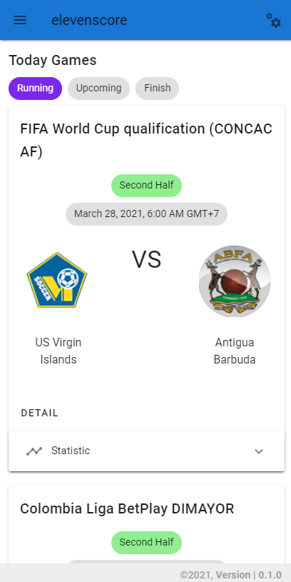
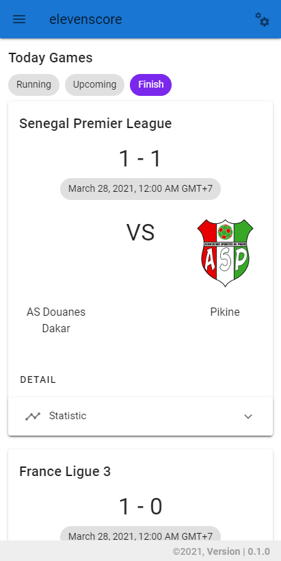
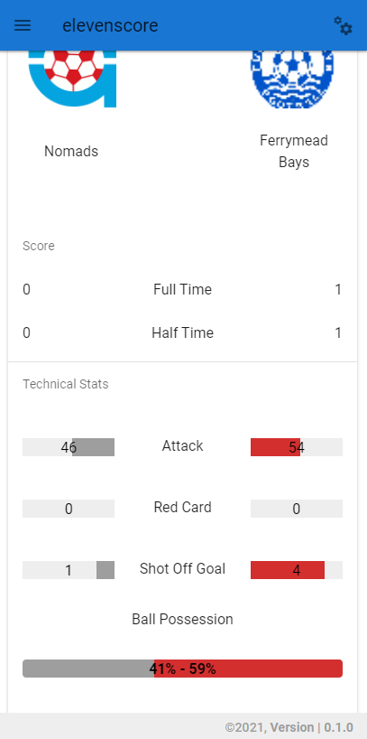

# livescore-vue

Display Football Data such as match fixture, score, match detail from elevenscore REST API.

<div align="center">
  
  
  
</div>

## Getting Started
These instructions will get you a copy of the project up and running on your local machine for development and testing purposes.

1. Download and install [Vue-CLI](https://cli.vuejs.org/).
2. Clone this repository.
3. Set API Key : `./src/config/auth`

## Project setup

```
npm install
```

### Compiles and hot-reloads for development

```
npm run serve
```

### Compiles and minifies for production

```
npm run build
```

### Lints and fixes files

```
npm run lint
```

### Customize configuration

See [Configuration Reference](https://cli.vuejs.org/config/).
